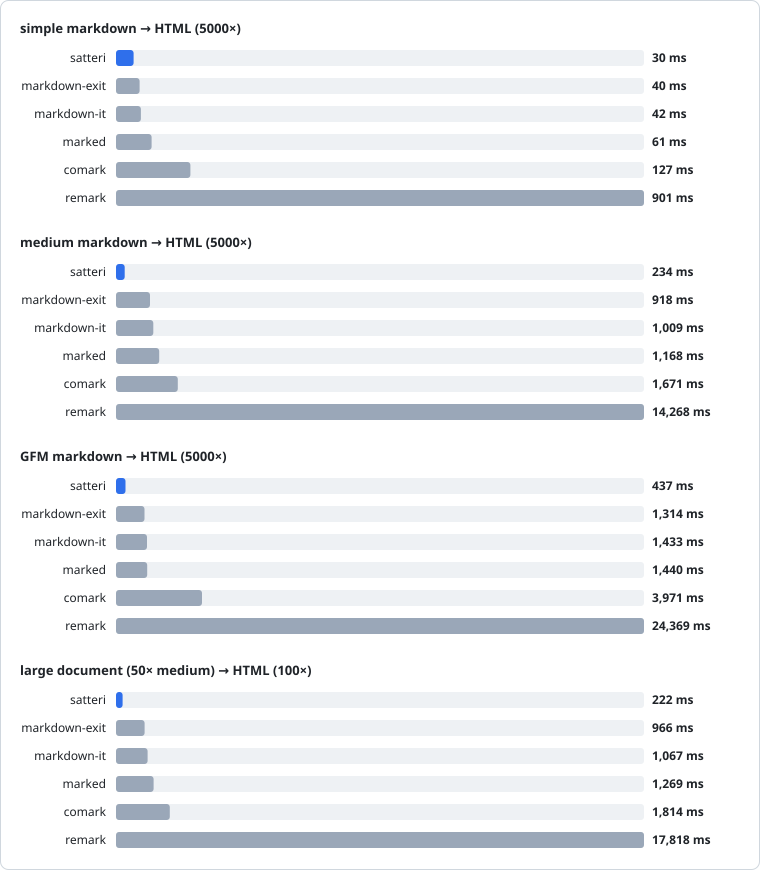
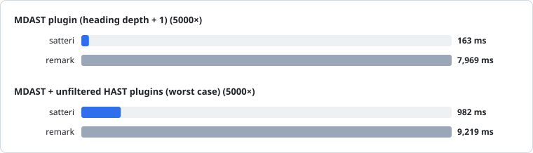
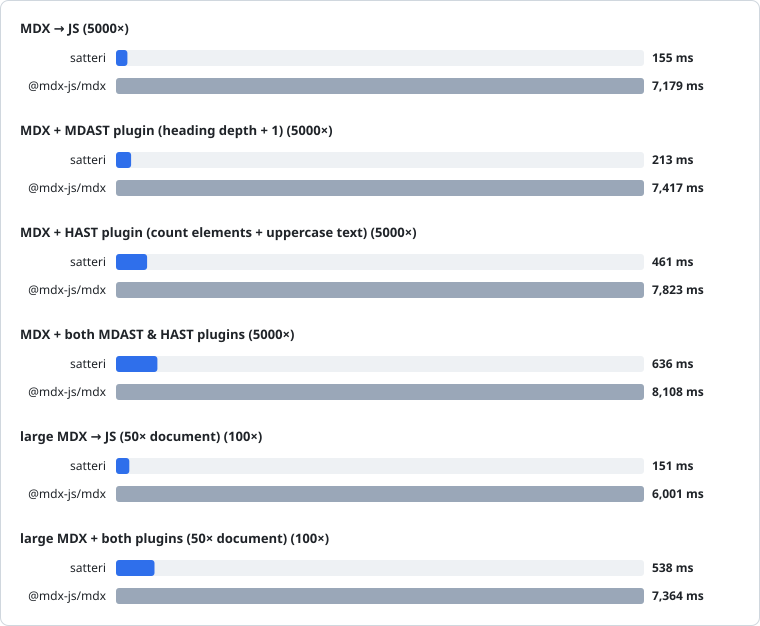
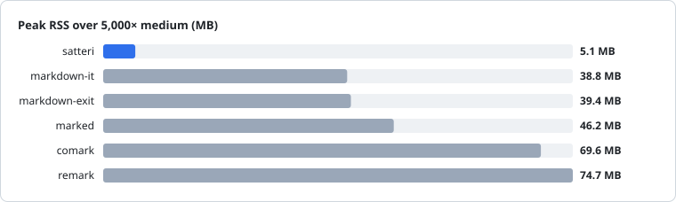
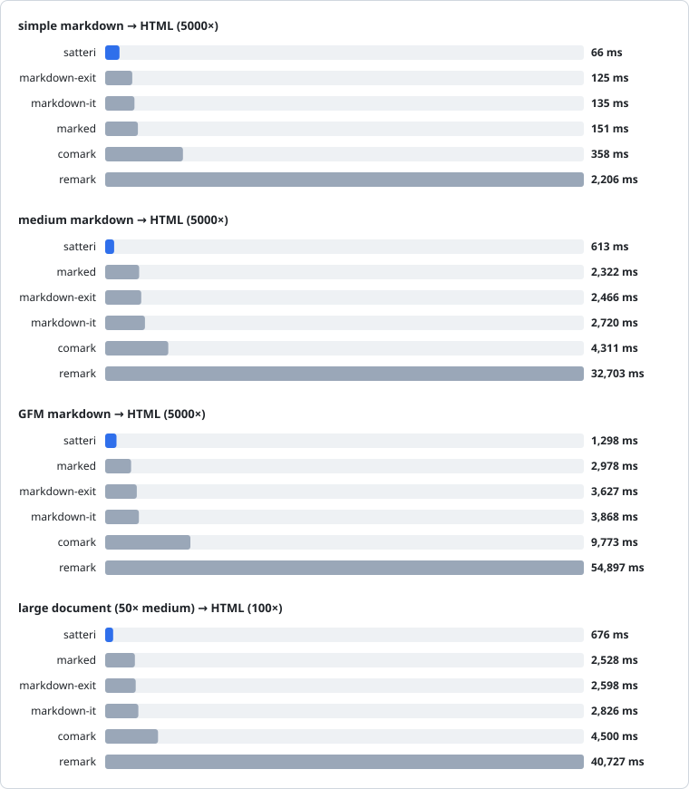
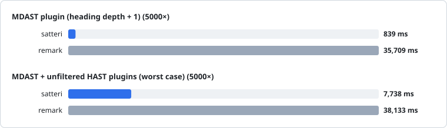
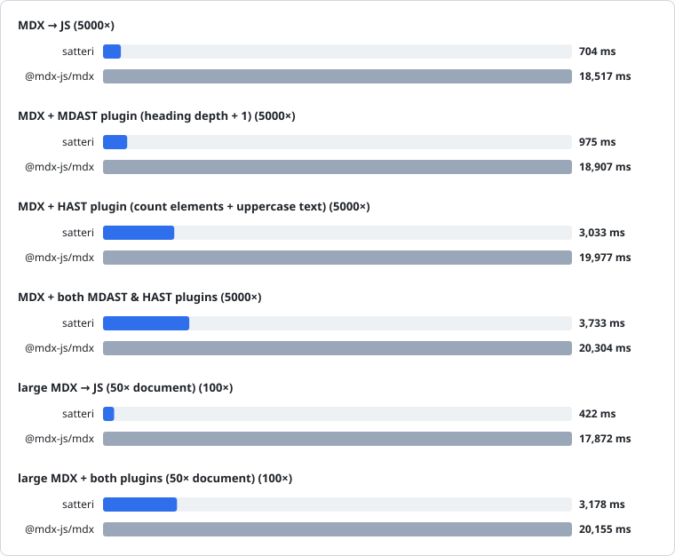
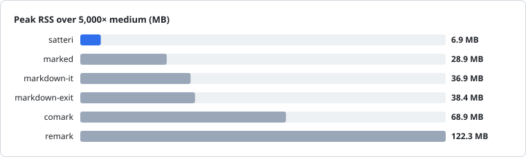

# web-markdown-benchmark

Benchmarks for the Markdown parsers commonly used in web development.

## Contenders

- [remark + rehype](https://github.com/remarkjs/remark)⁵
  - [@mdx-js/mdx](https://github.com/mdx-js/mdx) for MDX
- [Sätteri](https://github.com/bruits/satteri)¹
- [markdown-it](https://github.com/markdown-it/markdown-it)³⁵
- [markdown-exit](https://github.com/serkodev/markdown-exit)³⁵
- [marked](https://github.com/markedjs/marked)⁴
- [comark](https://github.com/comarkdown/comark)²⁵

¹I ([Princesseuh](https://github.com/princesseuh)) am the author of Sätteri.

²comark generates a slightly different HTML from the other libraries.

³markdown-it and markdown-exit do not support GFM, although they can be configured to somewhat emulate it (tables, strikethrough, autolinks, etc are possible, but not in a GFM-compliant way)

⁴marked supports the spec version of GFM, unlike remark, sätteri and comark which support the GitHub version of it. Notably, this means that marked's GFM implementation does not support footnotes.

⁵Every parser is configured to pass raw HTML through instead of escaping or dropping it: `html: true` for markdown-it and markdown-exit, `allowDangerousHtml` for remark, and the `html` plugin for comark. Sätteri and marked already do it by default. The fixtures contain no raw HTML, so this does not move the timings.

Comark's handling of HTML works differently from other parser because enabling HTML support for it implicitely means enabling parsing said HTML, whereas other pipelines just pass through the HTML as-is, optionally or not parsing it (ex: Sätteri with `features.rawHtml` or `remark` with `rehype-raw`)

## Results

<!-- bench:start -->

<!-- Generated by `nr bench:report`. Do not edit this section by hand. -->

Wall-clock time for N consecutive renders after warmup. Lower is better.

Every processor is solely configured for CommonMark. GFM support is enabled only for the GFM benchmark.

Fixtures: [simple](./bench/fixtures/simple.md) `0.2 KB`, [medium](./bench/fixtures/medium.md) `10 KB`, [GFM](./bench/fixtures/gfm.md) `8 KB`, large `≈500 KB` (medium ×50).

Package versions: `satteri@0.10.3`, `remark@15.0.1`, `markdown-it@15.0.0`, `marked@18.0.10`, `comark@0.6.2`, `@mdx-js/mdx@3.1.1`.

### AMD Ryzen 7 9800X3D

_Node v26.7.0, 2026-08-19._

#### Markdown → HTML

Raw numbers

| Parser        | simple (5000×, ms) | medium (5000×, ms) | GFM (5000×, ms) | large 50× (100×, ms) |
| ------------- | --------------------: | --------------------: | -----------------: | ----------------------: |
| satteri       |                    12 |                   119 |                257 |                     121 |
| markdown-exit |                    35 |                   586 |                  — |                     662 |
| marked        |                    59 |                 1,026 |              1,604 |                   1,167 |
| markdown-it   |                    83 |                 1,050 |                  — |                   1,126 |
| comark        |                   103 |                 1,182 |              3,874 |                   1,328 |
| remark        |                   567 |                 6,800 |             24,328 |                   9,545 |

#### Markdown → HTML with plugins

Raw numbers

| Scenario                                     | satteri (ms) | remark (ms) |
| -------------------------------------------- | -----------: | ----------: |
| MDAST plugin (heading depth + 1)             |          163 |       7,969 |
| MDAST + unfiltered HAST plugins (worst case) |          982 |       9,219 |

#### MDX → JS

Raw numbers

| Scenario                                            | Renders | satteri (ms) | @mdx-js/mdx (ms) |
| --------------------------------------------------- | ------: | -----------: | ---------------: |
| MDX → JS                                            |   5000× |          155 |            7,179 |
| MDX + MDAST plugin (heading depth + 1)              |   5000× |          213 |            7,417 |
| MDX + HAST plugin (count elements + uppercase text) |   5000× |          461 |            7,823 |
| MDX + both MDAST & HAST plugins                     |   5000× |          636 |            8,108 |
| large MDX → JS (50× document)                       |    100× |          151 |            6,001 |
| large MDX + both plugins (50× document)             |    100× |          538 |            7,364 |

#### Memory

_Peak resident memory growth over 5,000 consecutive renders of the medium fixture. Lower is better._

Raw numbers

| Parser        | peak RSS (MB) |
| ------------- | ------------: |
| satteri       |           5.0 |
| markdown-it   |          38.6 |
| markdown-exit |          39.0 |
| marked        |          46.5 |
| comark        |          68.7 |
| remark        |          76.9 |

### CI · GitHub Actions

_AMD EPYC 7763, Node v24.18.0, 2026-08-01._

#### Markdown → HTML

Raw numbers

| Parser        | simple (5000×, ms) | medium (5000×, ms) | GFM (5000×, ms) | large 50× (100×, ms) |
| ------------- | --------------------: | --------------------: | -----------------: | ----------------------: |
| satteri       |                    81 |                   624 |              1,310 |                     627 |
| markdown-exit |                   144 |                 2,529 |              3,773 |                   2,695 |
| marked        |                   161 |                 2,668 |              3,584 |                   2,904 |
| markdown-it   |                   140 |                 2,801 |              4,347 |                   3,033 |
| comark        |                   389 |                 4,273 |              9,459 |                   4,870 |
| remark        |                 2,332 |                33,631 |             56,384 |                  43,809 |

#### Markdown → HTML with plugins

Raw numbers

| Scenario                                     | satteri (ms) | remark (ms) |
| -------------------------------------------- | -----------: | ----------: |
| MDAST plugin (heading depth + 1)             |          856 |      37,061 |
| MDAST + unfiltered HAST plugins (worst case) |        4,812 |      39,471 |

#### MDX → JS

Raw numbers

| Scenario                                            | Renders | satteri (ms) | @mdx-js/mdx (ms) |
| --------------------------------------------------- | ------: | -----------: | ---------------: |
| MDX → JS                                            |   5000× |          860 |           21,653 |
| MDX + MDAST plugin (heading depth + 1)              |   5000× |        1,011 |           22,332 |
| MDX + HAST plugin (count elements + uppercase text) |   5000× |        2,388 |           23,717 |
| MDX + both MDAST & HAST plugins                     |   5000× |        3,142 |           24,443 |
| large MDX → JS (50× document)                       |    100× |          502 |           20,690 |
| large MDX + both plugins (50× document)             |    100× |        2,509 |           23,609 |

#### Memory

_Peak resident memory growth over 5,000 consecutive renders of the medium fixture. Lower is better._

Raw numbers

| Parser        | peak RSS (MB) |
| ------------- | ------------: |
| satteri       |           6.6 |
| marked        |          29.5 |
| markdown-it   |          36.3 |
| markdown-exit |          38.0 |
| comark        |          67.6 |
| remark        |         123.9 |

<!-- bench:end -->

<!-- deps:start -->

## Install footprint

<!-- Generated by `nr bench:deps`. Do not edit this section by hand. -->

Transitive dependency count and total on-disk size of each library's basic markdown → HTML pipeline, with no other extensions installed. `deps` counts packages pulled in beyond the libraries themselves; `install size` sums every file in the closure. For both stats, lower is better.

| Parser          | deps | install size |
| --------------- | ---: | -----------: |
| `marked`        |    0 |       459 KB |
| `markdown-exit` |    7 |       699 KB |
| `remark`        |   59 |      2.12 MB |
| `markdown-it`   |    6 |      2.50 MB |
| `comark`        |   16 |      3.46 MB |
| `satteri`       |    6 |      4.40 MB |
| `@mdx-js/mdx`   |  111 |      4.41 MB |

**Note:** Certain libraries inherently require multiple packages to provide Markdown to HTML. (ex: remark)

**Note 2:** For libraries with native binaries, the install size depends on the platform. Linux binaries (what is being measured here) tends to be on the larger side.

<!-- deps:end -->
